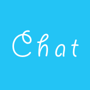
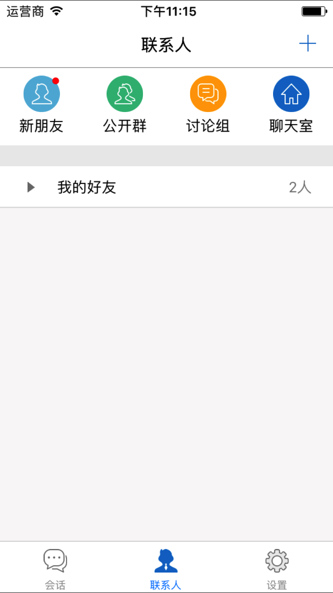

# Letchat

> 基于腾讯云平台的 iOS 端聊天系统

## Description

[简介]

## Timeline

- [x] 导入腾讯通讯云 SDK
- [x] 使用 tencentUI
- [x] 增加短信注册登录
- [x] 增加群聊功能
- [x] 增加图片收发功能
- [x] 增加文件传输功能
- [ ] 增加官方表情
- [ ] 增加黑名单

## Screenshot

## Usage

### 导入 Framework

从百度云下载腾讯云 sdk [link](https://pan.baidu.com/s/1pLqEGmn)，将 Framework 目录替换至 `Letchat/Letchat/TIMAdapter/` 中。

## MIT License

Copyright (c) 2017 Desgard_Duan

Permission is hereby granted, free of charge, to any person obtaining a copy
of this software and associated documentation files (the "Software"), to deal
in the Software without restriction, including without limitation the rights
to use, copy, modify, merge, publish, distribute, sublicense, and/or sell
copies of the Software, and to permit persons to whom the Software is
furnished to do so, subject to the following conditions:

The above copyright notice and this permission notice shall be included in all
copies or substantial portions of the Software.
